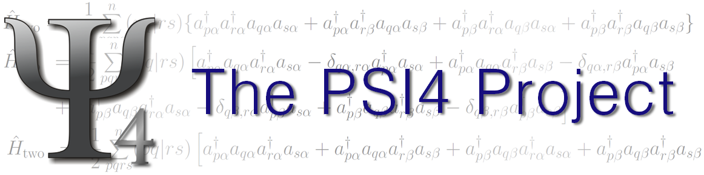

.. Psithon documentation master file, created by
   sphinx-quickstart on Sun Feb 12 04:25:25 2012.
   You can adapt this file completely to your liking, but it should at least
   contain the root `toctree` directive.

.. toctree::
   :maxdepth: 2

..  * NOTES (LAB 2-15-2012)
    * Blank lines in this file usually matter.
    * For each new python file, add a new automodule section like below
      to place an entry and slurp docstrings from all module members.
          .. automodule:: newpythonfile
              :members:
              :undoc-members:
    * If there are aliases to functions, like opt and optimize, add all but
      one name to :exclude-members: to avoid duplicating the documentation.
    * Function signatures are got by introspection. To show a more detailed
      signature with options, give it a separate autofunction line, like below,
      and add it to the :exclude-members: list. Place optional arguments in
      square brackets.
          .. autofunction:: wrappers.cp(name[, func, check_bsse])
..  * NOTES (LAB 2-21-2012)
    * Functions to be regularly accessed in the input file (usually those
      that kwargs passes through) should get their own section (like
      Energy below). In the early stages of documentation, just place 
      the autofunction command in the section. When ready to add documentation
      outside the docstring, create a new rst file, along the lines of database.
    * When using LaTeX math in rst files, the \ character that is so abundant
      in LaTeX commands can be used normally. When using math in docstrings,
      though, any \ followed by character combination that has a shell
      meaning (e.g., \t for tab, \b for bell, \n for newline) must be
      escaped (e.g., \\text or \\beta).

.. |dl| replace:: :math:`\Rightarrow`
.. |dr| replace:: :math:`\Leftarrow`

=======
General
=======

To allow arbitrarily complex computations to be performed, PSI4 was built
upon the Python interpreter, with modifications termed Psithon. Chapter 3
of the User's Manual described the non-standard Python associated with
molecule, basis, and option specification. This documentation addresses
the Python side- what functions allow the proper, compiled code to be run,
what functions post-process and interact with that output, and how the
ordinary (or ambitious) user can extent PSI4's functionality.

.. include:: notes.rst

======
Energy
======

.. autofunction:: driver.energy

========
Optimize
========

.. include:: ./opt.rst

========
Response
========

.. autofunction:: driver.response

=========
Frequency
=========

.. autofunction:: driver.frequency

====================
Counterpoise Correct
====================

.. include:: ./cp.rst

========
Database
========

.. include:: ./db.rst

==================
Complete Basis Set
==================

.. include:: ./cbs.rst

=====================
Fractional Occupation
=====================

.. automodule:: frac
    :members:
    :undoc-members:

============================
Beginner Psithon Programming
============================

.. include:: ./beginner.rst

.. _sec_intercalls:

===================
Function Intercalls
===================

table; handling func; no sow/reap

========================
Embarrassing Parallelism
========================

what functions; no intercalls; no local set; special section in parameter list

.. rst-class:: html-toggle
==================================
Psithon Programming Best Practices
==================================

stuff that's in README;

.. rst-class:: html-toggle
==============
PsiMod Methods
==============

.. rst-class:: html-toggle
================
Molecule Methods 
================

.. rst-class:: html-toggle
======
Expert
======

.. automodule:: driver
    :members:
    :undoc-members:
    :exclude-members: energy, optimize, opt, response, frequency, frequencies, freq 

.. automodule:: wrappers
    :members:
    :undoc-members:
    :exclude-members: nbody, cp, counterpoise_correct, counterpoise_correction, db, database, complete_basis_set, cbs,
        highest_1, scf_xtpl_helgaker_3, scf_xtpl_helgaker_2, corl_xtpl_helgaker_2

.. automodule:: aliases
    :members:
    :undoc-members:

.. automodule:: pubchem
    :members:
    :undoc-members:

.. automodule:: qmmm
    :members:
    :undoc-members:

.. automodule:: inpsight
    :members:
    :undoc-members:

.. automodule:: input
    :members:
    :undoc-members:

.. automodule:: physconst
    :members:
    :undoc-members:

.. automodule:: proc
    :members:
    :undoc-members:

.. automodule:: procutil
    :members:
    :undoc-members:

.. automodule:: psiexceptions
    :members:
    :undoc-members:

.. automodule:: text
    :members:
    :undoc-members:

.. automodule:: util
    :members:
    :undoc-members:

==================
Indices and Tables
==================

* :ref:`genindex`
* :ref:`modindex`
* :ref:`search`

