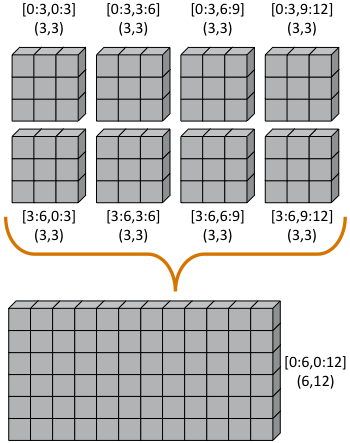
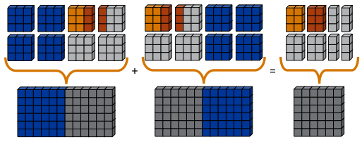
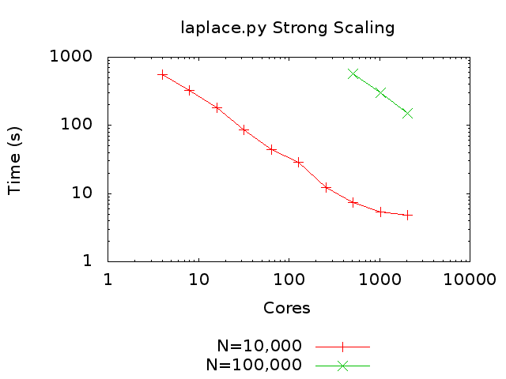

:author: Jeff Daily
:email: jeff.daily@pnnl.gov
:institution: Pacific Northwest National Laboratory

:author: Robert R. Lewis
:email: bobl@tricity.wsu.edu
:institution: Washington State University

--------------------------------------------------------------------------------
Using the Global Arrays Toolkit to Reimplement NumPy for Distributed Computation
--------------------------------------------------------------------------------

.. class:: abstract

   Global Arrays (GA) is a software system from Pacific Northwest National
   Laboratory that enables an efficient, portable, and parallel shared-memory
   programming interface to manipulate distributed dense arrays. Using a
   combination of GA and *NumPy*, we have reimplemented *NumPy* as a
   distributed drop-in replacement called Global Arrays in NumPy (*GAiN*).
   Scalability studies will be presented showing the utility of developing
   serial *NumPy* codes which can later run on more capable clusters or
   supercomputers.

.. class:: keywords

   Global Arrays, Python, NumPy, MPI

Introduction
------------

Scientific computing with Python typically involves using the *NumPy* package.
*NumPy* provides an efficient multi-dimensional array and array processing
routines. Unfortunately, like many Python programs, *NumPy* is serial in
nature.  This limits both the size of the arrays as well as the speed with
which the arrays can be processed to the available resources on a single
compute node.

For the most part, *NumPy* programs are written, debugged, and run in
singly-threaded environments. This may be sufficient for certain problem
domains. However, *NumPy* may also be used to develop prototype software. Such
software is usually ported to a different, compiled language and/or explicitly
parallelized to take advantage of additional hardware.

Global Arrays in NumPy (*GAiN*) is an extension to Python that provides
parallel, distributed processing of arrays. It implements a subset of the
*NumPy* API so that for some programs, by simply importing *GAiN* in place of
*NumPy* they may be able to take advantage of parallel processing
transparently. Other programs may require slight modification. This allows
those programs to take advantage of the additional cores available on single
compute nodes and to increase problem sizes by distributing across clustered
environments.

Background
----------

Like any complex piece of software, *GAiN* builds on many other foundational
ideas and implementations. This background is not intended to be a complete
reference, rather only what is necessary to understand the design and
implementation of *GAiN*. Further details may be found by examining the
references or as otherwise noted.

*NumPy*
=======

*NumPy* [Oli06]_ is a Python extension module which adds a powerful
multidimensional array class ``ndarray`` to the Python language. *NumPy* also
provides scientific computing capabilities such as basic linear algebra and
Fourier transform support. *NumPy* is the de facto standard for scientific
computing in Python and the successor of the other numerical Python packages
Numarray [Dub96]_ and numeric [Asc99]_.

.. *NumPy*'s ndarray
.. =================

The primary class defined by *NumPy* is ``ndarray``. The ``ndarray`` is
implemented as a contiguous memory segment. Internally, all ``ndarray``
instances have a pointer to the location of the first element as well as the
attributes ``shape``, ``ndim``, and ``strides``. ``ndim`` describes the number
of dimensions in the array, ``shape`` describes the number of elements in each
dimension, and ``strides`` describes the number of bytes between consecutive
elements per dimension. The ``ndarray`` can be either FORTRAN- or C-ordered.
Recall that in FORTRAN, the first dimension has a stride of one while it is
the opposite (last) dimension in C. ``shape`` can be modified while ``ndim``
and ``strides`` are read-only and used internally, although their exposure to
the programmer may help in developing certain algorithms.

The creation of ``ndarray`` instances is complicated by the various ways in
which it can be done such as explicit constructor calls, view casting, or
creating new instances from template instances (e.g. slicing). To this end,
the ``ndarray`` does not implement Python’s ``__init__()`` object constructor.
Instead, ``ndarrays`` use the ``__new__()`` ``classmethod``. Recall that
``__new__()`` is Python’s hook for subclassing its built-in objects. If
``__new__()`` returns an instance of the class on which it is defined, then
the class's ``__init__()`` method is also called. Otherwise, the
``__init__()`` method is not called. Given the various ways that ``ndarray``
instances can be created, the ``__new__()`` ``classmethod`` might not always
get called to properly initialize the instance.  ``__array_finalize__()`` is
called instead of ``__init__()`` for ``ndarray`` subclasses to avoid this
limitation.

.. *NumPy*'s Universal Functions
.. =============================

The element-wise operators in *NumPy* are known as *Universal Functions*, or
*ufuncs*. Many of the methods of ``ndarray`` simply invoke the corresponding
ufunc. For example, the operator ``+`` calls ``ndarray.__add__()`` which
invokes the ufunc ``add``. Ufuncs are either unary or binary, taking either
one or two arrays as input, respectively. Ufuncs always return the result of
the operation as an ``ndarray`` or ``ndarray`` subclass. Optionally, an
additional output parameter may be specified to receive the results of the
operation.  Specifying this output parameter to the ufunc avoids the sometimes
unnecessary creation of a new ``ndarray``.

.. Ufuncs are more than just callable functions. They also have some special
.. methods such as ``reduce`` and ``accumulate``. ``reduce`` is similar to
.. Python’s built-in function of the same name that repeatedly applies a callable
.. object to its last result and the next item of the sequence. This effectively
.. reduces a sequence to a single value. When applied to arrays the reduction
.. occurs along the first axis by default, but other axes may be specified. Each
.. ufunc defines the function that is used for the reduction. For example,
.. ``add`` will sum the values along an axis while ``multiply`` will generate the
.. running product.  ``accumulate`` is similar to reduce, but it returns the
.. intermediate results of the reduction.

Ufuncs can operate on ``ndarray`` subclasses or array-like objects. In order
for subclasses of the ``ndarray`` or array-like objects to utilize the ufuncs,
they may define three methods or one attribute which are
``__array_prepare__()``, ``__array_wrap__()``, ``__array__()``, and
``__array_priority__``, respectively.  The ``__array_prepare__()`` and
``__array_wrap__()`` methods will be called on either the output, if
specified, or the input with the highest ``__array_priority__``.
``__array_prepare__()`` is called on the way into the ufunc after the output
array is created but before any computation has been performed and
``__array_wrap__()`` is called on the way out of the ufunc. Those two
functions exist so that ``ndarray`` subclasses can properly modify any
attributes or properties specific to their subclass. Lastly, if an output is
specified which defines an ``__array__()`` method, results will be written to
the object returned by calling ``__array__()``.

Single Program, Multiple Data 
=============================

Parallel applications can be classified into a few well defined programming
paradigms. Each paradigm is a class of algorithms that have the same control
structure. The literature differs in how these paradigms are classified and
the boundaries between paradigms can sometimes be fuzzy or intentionally
blended into hybrid models [Buy99]_. The Single Program Multiple Data (SPMD)
paradigm is one example.  With SPMD, each process executes essentially the
same code but on a different part of the data. The communication pattern is
highly structured and predictable. Occasionally, a global synchronization may
be needed. The efficiency of these types of programs depends on the
decomposition of the data and the degree to which the data is independent of
its neighbors. These programs are also highly susceptible to process failure.
If any single process fails, generally it causes deadlock since global
synchronizations thereafter would fail.

Message Passing Interface (MPI)
===============================

Message passing libraries allow efficient parallel programs to be written for
distributed memory systems. MPI [Gro99a]_, also known as MPI-1, is a library
specification for message-passing that was standardized in May 1994 by the MPI
Forum. It is designed for high performance on both massively parallel machines
and on workstation clusters. An optimized MPI implementation exists on nearly
all modern parallel systems and there are a number of freely available,
portable implementations for all other systems [Buy99]_.  As such, MPI is the
de facto standard for writing massively parallel application codes in either
FORTRAN, C, or C++.

The MPI-2 standard [Gro99b]_ was first completed in 1997 and added a number of
important additions to MPI including, but not limited to, one-sided
communication and the C++ language binding. Before MPI-2, all communication
required explicit handshaking between the sender and receiver via
``MPI_Send()`` and ``MPI_Recv()`` in addition to non-blocking variants.
MPI-2’s one-sided communication model allows reads, writes, and accumulates of
remote memory without the explicit cooperation of the process owning the
memory. If synchronization is required at a later time, it can be requested
via ``MPI_Barrier()``. Otherwise, there is no strict guarantee that a
one-sided operation will complete before the data segment it accessed is used
by another process.

mpi4py
======

mpi4py is a Python wrapper around MPI. It is written to mimic the C++ language
bindings. It supports point-to-point communication, one-sided communication,
as well as the collective communication models. Typical communication of
arbitrary objects in the FORTRAN or C bindings of MPI require the programmer
to define new MPI datatypes. These datatypes describe the number and order of
the bytes to be communicated. On the other hand, strings could be sent without
defining a new datatype so long as the length of the string was understood by
the recipient.  mpi4py is able to communicate any serializable Python object
since serialized objects are just byte streams. mpi4py also has special
enhancements to efficiently communicate any object implementing Python’s
buffer protocol, such as *NumPy* arrays. It also supports dynamic process
management and parallel I/O [Dal05]_ [Dal08]_.

Global Arrays and Aggregate Remote Memory Copy Interface
========================================================

The GA toolkit [Nie06]_ [Nie10]_ [Pnl11]_ is a software system from Pacific
Northwest National Laboratory that enables an efficient, portable, and
parallel shared-memory programming interface to manipulate physically
distributed dense multidimensional arrays, without the need for explicit
cooperation by other processes. GA compliments the message-passing programming
model and is compatible with MPI so that the programmer can use both in the
same program. GA has supported Python bindings since version 5.0. Arrays are
created by calling one of the creation routines such as ``ga.ceate()``,
returning an integer handle which is passed to subsequent operations. The GA
library handles the distribution of arrays across processes and recognizes
that accessing local memory is faster than accessing remote memory. However,
the library allows access mechanisms for any part of the entire distributed
array regardless of where its data is located. Local memory is acquired via
``ga.access()`` returning a pointer to the data on the local process, while
remote memory is retrieved via ``ga.get()`` filling an already allocated array
buffer. Individual discontiguous sets of array elements can be updated or
retrieved using ``ga.scatter()`` or ``ga.gather()``, respectively.  GA has
been leveraged in several large computational chemistry codes and has been
shown to scale well [Apr09]_.

The Aggregate Remote Memory Copy Interface (ARMCI) provides general-purpose,
efficient, and widely portable remote memory access (RMA) operations
(one-sided communication). ARMCI operations are optimized for contiguous and
non-contiguous (strided, scatter/gather, I/O vector) data transfers. It also
exploits native network communication interfaces and system resources such as
shared memory [Nie00]_.  ARMCI provides simpler progress rules and a less
synchronous model of RMA than MPI-2. ARMCI has been used to implement the
Global Arrays library, GPSHMEM - a portable version of Cray SHMEM library, and
the portable Co-Array FORTRAN compiler from Rice University [Dot04]_.

Cython
======

Cython [Beh11]_ is both a language which closely resembles Python as well as a
compiler which generates C code based on Python's C API. The Cython language
additionally supports calling C functions as well as static typing. This makes
writing C extensions or wrapping external C libraries for the Python language
as easy as Python itself.

Previous Work
-------------

*GAiN* is similar in many ways to other parallel computation software
packages.  It attempts to leverage the best ideas for transparent, parallel
processing found in current systems. The following packages provided insight
into how *GAiN* was to be developed.

.. Star-P
.. ======

MITMatlab [Hus98]_, which was later rebranded as Star-P [Ede07]_, provides a
client-server model for interactive, large-scale scientific computation. It
provides a transparently parallel front end through the popular MATLAB
[Pal07]_ numerical package and sends the parallel computations to its Parallel
Problem Server. Star-P briefly had a Python interface. Separating the
interactive, serial nature of MATLAB from the parallel computation server
allows the user to leverage both of their strengths. This also allows much
larger arrays to be operated over than is allowed by a single compute node.

.. Global Arrays Meets MATLAB
.. ==========================

Global Arrays Meets MATLAB (GAMMA) [Pan06]_ provides a MATLAB binding to the
GA toolkit, thus allowing for larger problem sizes and parallel computation.
GAMMA can be viewed as a GA implementation of MITMatlab and was shown to scale
well even within an interpreted environment like MATLAB.

.. IPython
.. =======

IPython [Per07]_ provides an enhanced interactive Python shell as well as an
architecture for interactive parallel computing. IPython supports practically
all models of parallelism but, more importantly, in an interactive way. For
instance, a single interactive Python shell could be controlling a parallel
program running on a supercomputer. This is done by having a Python engine
running on a remote machine which is able to receive Python commands.

.. IPython's distarray
.. ===================

distarray [Gra09]_ is an experimental package for the IPython project.
distarray uses IPython’s architecture as well as MPI extensively in order to
look and feel like *NumPy* ``ndarray`` instances. Only the SPMD model of parallel
computation is supported, unlike other parallel models supported directly by
IPython.  Further, the status of distarray is that of a proof of concept and
not production ready.

.. GpuPy
.. =====

A Graphics Processing Unit (GPU) is a powerful parallel processor that is
capable of more floating point calculations per second than a traditional CPU.
However, GPUs are more difficult to program and require other special
considerations such as copying data from main memory to the GPU’s on-board
memory in order for it to be processed, then copying the results back. The
GpuPy [Eit07]_ Python extension package was developed to lessen these burdens
by providing a *NumPy*-like interface for the GPU. Preliminary results
demonstrate considerable speedups for certain single-precision floating point
operations.

.. pyGA
.. ====

A subset of the Global Arrays toolkit was wrapped in Python for the 3.x series
of GA by Robert Harrison [Har99]_. It illustrated some important concepts such
as the benefits of integration with *NumPy* -- the local or remote portions of
the global arrays were retrieved as *NumPy* arrays at which point they could
be used as inputs to *NumPy* functions like the ufuncs.

.. However, the
.. burden was still on the programmer to understand the SPMD nature of the
.. program. For example, when accessing the global array as an ``ndarray``, the array
.. shape and dimensions would match that of the local array maintained by the
.. process calling the access function. Such an implementation is entirely
.. correct, however there was no attempt to handle slicing at the global level as
.. it is implemented in *NumPy*. In short, pyGA recognized the benefit of
.. returning portions of the global array wrapped in a *NumPy* array, but it did
.. not treat the global arrays as if they were themselves a subclass of the
.. ``ndarray``.

.. Co-Array Python
.. ===============

Co-Array Python [Ras04]_ is modeled after the Co-Array FORTRAN extensions to
FORTRAN 95. It allows the programmer to access data elements on non-local
processors via an extra array dimension, called the co-dimension. The
``CoArray`` module provided a local data structure existing on all processors
executing in a SPMD fashion. The CoArray was designed as an extension to
Numeric Python [Asc99]_.

Design
------

.. There comes a point at which a single compute node does not have the resources
.. necessary for executing a given problem.

The need for parallel programming and running these programs on parallel
architectures is obvious, however, efficiently programming for a parallel
environment can be a daunting task. One area of research is to automatically
parallelize otherwise serial programs and to do so with the least amount of
user intervention [Buy99]_. *GAiN* attempts to do this for certain Python
programs utilizing the *NumPy* module. It will be shown that some *NumPy*
programs can be parallelized in a nearly transparent way with *GAiN*.

There are a few assumptions which govern the design of *GAiN*. First, all
documented *GAiN* functions are collective. Since Python and *NumPy* were
designed to run serially on workstations, it naturally follows that *GAiN*,
running in an SPMD fashion, will execute every documented function
collectively. Second, only certain arrays should be distributed. In general,
it is inefficient to distribute arrays which are relatively small and/or easy
to compute. It follows, then, that *GAiN* operations should allow mixed inputs
of both distributed and local array-like objects. Further, *NumPy* represents
an extensive, useful, and hardened API. Every effort to reuse *NumPy* should
be made. Lastly, GA has its own strengths to offer such as processor groups
and custom data distributions. In order to maximize scalability of this
implementation, we should enable the use of processor groups [Nie05]_.

A distributed array representation must acknowledge the duality of a global
array and the physically distributed memory of the array. Array attributes
such as ``shape`` should return the global, coalesced representation of the
array which hides the fact the array is distributed. But when operations such
as ``add()`` are requested, the corresponding pieces of the input arrays must
be operated over. Figure :ref:`fig1` will help illustrate.  Each local piece
of the array has its own shape (in parenthesis) and knows its portion of the
distribution (in square brackets). Each local piece also knows the global
shape.

    :label:`fig1`
    Each local piece of the ``gain.ndarray`` has its own shape (in
    parenthesis) and knows its portion of the distribution (in square
    brackets). Each local piece also knows the global shape.

A fundamental design decision was whether to subclass ``ndarray`` or to
provide a work-alike replacement for the entire ``numpy`` module. The *NumPy*
documentation states that ``ndarray`` implements ``__new__()`` in order to
control array creation via constructor calls, view casting, and slicing.
Subclasses implement ``__new__()`` for when the constructor is called
directly, and ``__array_finalize__()`` in order to set additional attributes
or further modify the object from which a view has been taken. One can imagine
an ``ndarray`` subclass called ``gainarray`` circumventing the usual
``ndarray`` base class memory allocation and instead allocating a smaller
``ndarray`` per process while retaining the global ``shape``. One problem
occurs with view casting -- with this approach the other ``ndarray``
subclasses know nothing of the distributed nature of the memory within the
``gainarray``. *NumPy* itself is not designed to handle distributed arrays. By
design, ufuncs create an output array when one is not specified. The first
hook which *NumPy* provides is ``__array_prepare__()`` which is called *after
the output array has been created*. This means any ufunc operation on one or
more ``gainarray`` instances without a specified output would automatically
allocate the entire output on each process. For this reason alone, we opted to
reimplement the entire ``numpy`` module, controlling all aspects of array
creation and manipulation to take into account distributed arrays.

We present a new Python module, ``gain``, developed as part of the main Global
Arrays software distribution. The release of GA v5.0 contained Python bindings
based on the complete GA C API, available in the extension module ``ga``. The
GA bindings as well as the ``gain`` module were developed using Cython. With
the upcoming release of GA v5.1, the module ``ga.gain`` is available as a
drop-in replacement for *NumPy*.  The goal of the implementation is to allow
users to write

.. code-block:: python

    import ga.gain as numpy

and then to execute their code using the MPI process manager

.. code-block:: bash

    mpiexec -np 4 python script.py

In order to succeed as a drop-in replacement, all attributes, functions,
modules, and classes which exist in ``numpy`` must also exist within ``gain``.
Efforts were made to reuse as much of ``numpy`` as possible, such as its type
system. As of GA v5.1, arrays of arbitrary fixed-size element types and sizes
can be created and individual fields of C ``struct`` data types accessed
directly.  *GAiN* is able to use the ``numpy`` types when creating the GA
instances which back the ``gain.ndarray`` instances.

*GAiN* follows the owner-computes rule [Zim88]_. The rule assigns each
computation to the processor that owns the data being computed. Figures
:ref:`fig2` and :ref:`fig3` illustrate the concept. For any array computation,
*GAiN* bases the computation on the output array. The processes owning
portions of the output array will acquire the corresponding pieces of the
input array(s) and then perform the computation locally, *calling the original
NumPy routine* on the corresponding array portions. In some cases, for example
if the output array is a view created by a slicing operation, certain
processors will have no computation to perform.

.. figure:: image3_crop.png

    :label:`fig2`
    Add two arrays with the same data distribution. There are eight processors
    for this computation.  Following the owner-computes rule, each process
    owning a piece of the output array (far right) retrieves the corresponding
    pieces from the sliced input arrays (left and middle). For example, the
    corresponding gold elements will be computed locally on the owning
    process.  Note that for this computation, the data distribution is the
    same for both input arrays as well as the output array such that
    communication can be avoided by using local data access.

    :label:`fig3`
    Add two sliced arrays. There are eight processors for this computation.
    The elements in blue were removed by a slice operation. Following the
    owner-computes rule, each process owning a piece of the output array (far
    right) retrieves the corresponding pieces from the sliced input arrays
    (left and middle). For example, the corresponding gold elements will be
    computed locally on the owning process. Similarly for the copper elements.
    Note that for this computation, the data for each array is not
    equivalently distributed which will result in communication.

.. ``gain.ndarray`` and array operations
.. =====================================

The *GAiN* implementation of the ``ndarray`` implements a few important
concepts including the dual nature of a global array and its individual
distributed pieces, slice arithmetic, and separating collective operations
from one-sided operations. When a ``gain.ndarray`` is created, it creates a
Global Array of the same shape and type and stores the GA integer handle. The
distribution on a given process can be queried using ``ga.distribution()``.
The other important attribute of the ``gain.ndarray`` is the *global_slice*.
The global_slice begins as a list of ``slice`` objects based on the original
``shape`` of the array.

.. code-block:: python

    self.global_slice = [slice(0,x,1) for x in shape]

Slicing a ``gain.ndarray`` must return a view just like slicing a
``numpy.ndarray`` returns a view. The approach taken is to apply the ``key``
of the ``__getitem__(key)`` request to the ``global_slice`` and store the new
``global_slice`` on the newly created view. We call this type of operation
*slice arithmetic*. First, the ``key`` is *canonicalized* meaning ``Ellipsis``
are replaced with ``slice(0,dim_max,1)`` for each dimension represented by the
``Ellipsis``, all ``slice`` instances are replaced with the results of calling
``slice.indices()``, and all negative index values are replaced with their
positive equivalents. This step ensures that the length of the ``key`` is
compatible with and based on the current shape of the array.  This enables
consistent slice arithmetic on the canonicalized keys. Slice arithmetic
effectively produces a new ``key`` which, when applied to the same original
array, produces the same results had the same sequence of keys been applied in
order. Figures :ref:`figslice1` and :ref:`figslice2` illustrate this concept.

.. figure:: image4a_crop.png

    :label:`figslice1`
    Slice arithmetic example 1. Array ``b`` could be created either using the
    standard notation (top middle) or using the *canonicalized* form (bottom
    middle). Array ``c`` could be created by applying the standard notation
    (top right) or by applying the equivalent canonical form (bottom right) to
    the original array ``a``.

.. figure:: image4b_crop.png

    :label:`figslice2`
    Slice arithmetic example 2. See the caption of Figure :ref:`figslice1` for
    details.

When performing calculations on a ``gain.ndarray``, the current
``global_slice`` is queried when accessing the local data or fetching remote
data such that an appropriate ``ndarray`` data block is returned.  Accessing
local data and fetching remote data is performed by the
``gain.ndarray.access()`` and ``gain.ndarray.get()`` methods, respectively.
Figure :ref:`figaccessget` illustrates how ``access()`` and ``get()`` are
used. The ``ga.access()`` function on which ``gain.ndarray.access()`` is based
will always return the entire block owned by the calling process. The returned
piece must be further sliced to appropriately match the current
``global_slice``. The ``ga.strided_get()`` function on which
``gain.ndarray.get()`` method is based will fetch data from other processes
without the remote processes' cooperation i.e. using one-sided communication.
The calling process specifies the region to fetch based on the current view's
``shape`` of the array. The ``global_slice`` is adjusted to match the
requested region using slice arithmetic and then transformed into a
``ga.strided_get()`` request based on the global, original shape of the array.

.. figure:: image5_crop.png
    :scale: 60%

    :label:`figaccessget`
    ``access()`` and ``get()`` examples. The current ``global_slice``,
    indicated by blue array elements, is respected in either case. A process
    can access its local data block for a given array (red highlight). Note
    that ``access()`` returns the entire block, including the sliced elements.
    Any process can fetch any other processes' data using ``get()`` with
    respect to the current ``shape`` of the array (blue highlight).  Note that
    the fetched block will not contain the sliced elements, reducing the
    amount of data communicated.

Recall that GA allows the contiguous, process-local data to be accessed using
``ga.access()`` which returns a C-contiguous ``ndarray``. However, if the
``gain.ndarray`` is a view created by a slice, the data which is accessed will
be contiguous while the view is not. Based on the distribution of the
process-local data, a new slice object is created from the ``global_slice``
and applied to the accessed ``ndarray``, effectively having applied first the
``global_slice`` on the global representation of the distributed array
followed by a slice representing the process-local portion.

After process-local data has been accessed and sliced as needed, it must then
fetch the remote data. This is again done using ``ga.get()`` or
``ga.strided_get()`` as above.  Recall that one-sided communication, as
opposed to two-sided communication, does not require the cooperation of the
remote process(es). The local process simply fetches the corresponding array
section by performing a similar transformation to the target array's
``global_slice`` as was done to access the local data, and then translates the
modified ``global_slice`` into the proper arguments for ``ga.get()`` if the
``global_slice`` does not contain any ``step`` values greater than one, or
``ga.strided_get()`` if the ``global_slice`` contained ``step`` values greater
than one.

One limitation of using GA is that GA does not allow negative stride values
corresponding to the negative ``step`` values allowed for Python sequences and
*NumPy* arrays. Supporting negative ``step`` values for *GAiN* required
special care -- when a negative ``step`` is encountered during a slice
operation, the slice is applied as usual. However, prior to accessing or
fetching data, the slice is inverted from a negative ``step`` to a positive
``step`` and the ``start`` and ``stop`` values are updated appropriately. The
``ndarray`` which results from accessing or fetching based on the inverted
slice is then re-inverted, creating the correct view of the new data.

Another limitation of using GA is that the data distribution cannot be changed
once an array is created. This complicates such useful functionality as
``numpy.reshape()``. Currently, *GAiN* must make a copy of the array instead
of a view when altering the shape of an array.

.. ``gain.flatiter``
.. =================

Translating the ``numpy.flatiter`` class, which assumes a single address space while
translating an N-dimensional array into a 1D array, into a distributed form
was made simpler by the use of ``ga.gather()`` and ``ga.scatter()``. These two
routines allow individual data elements within a GA to be fetched or updated.
Flattening a distributed N-dimensional array which had been distributed in
blocked fashion will cause the blocks to become discontiguous. Figure
:ref:`figflatten` shows how a :math:`6 \times 6` array might be distributed and flattened.
The ``ga.get()`` operation assumes the requested patch has the same number of
dimensions as the array from which the patch is requested. Reshaping, in
general, is made difficult by GA and its lack of a redistribute capability.
However, in this case, we can use ``ga.gather()`` and ``ga.scatter()`` to
fetch and update, respectively, any array elements in any order.
``ga.gather()`` takes a 1D array-like of indices to fetch and returns a 1D
``ndarray`` of values. Similarly, ``ga.scatter()`` takes a 1D array-like of
indices to update and a 1D array-like buffer containing the values to use for
the update. If a ``gain.flatiter`` is used as the output of an operation,
following the owner-computes rule is difficult. Instead, pseudo-owners are
assigned to contiguous slices of the of 1D view. These pseudo-owners gather
their own elements as well as the corresponding elements of the other inputs,
compute the result, and scatter the result back to their own elements. This
results in additional communication which is otherwise avoided by true
adherence to the owner-computes rule. To avoid this inefficiency, there are
some cases where operating over ``gain.flatiter`` instances can be optimized,
for example with ``gain.dot()`` if the same ``flatiter`` is passed as both
inputs, the ``base`` of the ``flatiter`` is instead multiplied together
element-wise and then the ``gain.sum()`` is taken of the resulting array.

.. figure:: image6_crop.png

    :label:`figflatten`
    Flattening a 2D distributed array. The block owned by a process becomes
    discontiguous when representing the 2D array in 1 dimension.

Evaluation
----------

The success of *GAiN* hinges on its ability to enable distributed array
processing in *NumPy*, to transparently enable this processing, and most
importantly to efficiently accomplish those goals. Performance Python [Ram08]_
“perfpy” was conceived to demonstrate the ways Python can be used for high
performance computing. It evaluates *NumPy* and the relative performance of
various Python extensions to *NumPy*. It represents an important benchmark by
which any additional high performance numerical Python module should be
measured. The original program ``laplace.py`` was modified by importing
``ga.gain`` in place of ``numpy`` and then stripping the additional test codes
so that only the ``gain`` (``numpy``) test remained. The latter modification
makes no impact on the timing results since all tests are run independently
but was necessary because ``gain`` is run on multiple processes while the
original test suite is serial.  The program was run on the chinook
supercomputer at the Environmental Molecular Sciences Laboratory, part of
Pacific Northwest National Laboratory.  Chinook consists of 2310 HP DL185
nodes with dual socket, 64-bit, Quad-core AMD 2.2 GHz Opteron processors. Each
node has 32 Gbytes of memory for 4 Gbytes per core. Fast communication between
the nodes is obtained using a single rail Infiniband interconnect from
Voltaire (switches) and Melanox (NICs). The system runs a version of Linux
based on Red Hat Linux Advanced Server.  *GAiN* utilized up to 512 nodes of
the cluster, using 4 cores per node.

In Figure :ref:`figlaplace`, *GAiN* is shown to scale up to 2K cores on a
modest problem size. *GAiN* is also able to run on problems which are not
feasible on workstations. For example, to store one 100,000x100,000 matrix of
double-precision numbers requires approximately 75GB.

    :label:`figlaplace`
    ``laplace.py`` for N=10,000 and N=100,000. For N=10,000, one matrix of
    double-precision numbers is approximately 0.75GB. For this problem, *GAiN*
    scales up to 2K cores. For N=100,000, one matrix of double-precision
    numbers is approximately 75GB. In addition to handling this large-scale
    problem, *GAiN* continues to scale up to 2K cores.

.. .. table:: ``laplace.py`` for N=10,000. One matrix of double-precision
..     numbers is approximately 0.75GB. For this problem, *GAiN* scales up to 2K
..     cores. The results for native *NumPy* are shown for the first, single-core
..     row. Even for a modest number of cores, *GAiN* is much
..     faster. :label:`tabscaling` 
.. 
..     +-------+-----------------+---------------+
..     | Cores | Solver Time (s) | Wall Time (s) |
..     +-------+-----------------+---------------+
..     | 1     | 843.43          | 845           |
..     +-------+-----------------+---------------+
..     | 4     | 560.03          | 564           |
..     +-------+-----------------+---------------+
..     | 8     | 322.81          | 333           |
..     +-------+-----------------+---------------+
..     | 16    | 180.35          | 191           |
..     +-------+-----------------+---------------+
..     | 32    | 86.71           | 97            |
..     +-------+-----------------+---------------+
..     | 64    | 44.43           | 56            |
..     +-------+-----------------+---------------+
..     | 128   | 28.67           | 38            |
..     +-------+-----------------+---------------+
..     | 256   | 12.15           | 34            |
..     +-------+-----------------+---------------+
..     | 512   | 7.38            | 43            |
..     +-------+-----------------+---------------+
..     | 1024  | 5.31            | 72            |
..     +-------+-----------------+---------------+
..     | 2048  | 4.84            | 131           |
..     +-------+-----------------+---------------+
.. 
.. .. table:: ``laplace.py`` for N=100,000. One matrix of double-precision
..     numbers is approximately 75GB. In addition to handling this large-scale
..     problem, *GAiN* continues to scale again up to 2K cores. :label:`tabbig`
.. 
..     +-------+-----------------+---------------+
..     | Cores | Solver Time (s) | Wall Time (s) |
..     +-------+-----------------+---------------+
..     | 512   |  567.46         |  602          |
..     +-------+-----------------+---------------+
..     | 1024  |  299.48         |  366          |
..     +-------+-----------------+---------------+
..     | 2048  |  150.36         |  270          |
..     +-------+-----------------+---------------+

During the evaluation, it was noted that a lot of time was spent within global
synchronization calls e.g. ``ga.sync()``. The source of the calls was traced
to, among other places, the vast number of temporary arrays getting created.
Using GA statistics reporting, the original ``laplace.py`` code created 912
arrays and destroyed 910. Given this staggering figure, an array cache was
created. The cache is based on a Python ``dict`` using the shape and type of
the arrays as the keys and stores discarded GA instances represented by the GA
integer handle. The number of GA handles stored per shape and type is referred
to as the cache depth. The ``gain.ndarray`` instances are discarded as usual.
Utilizing the cache keeps the GA memory from many allocations and
deallocations but primarily avoids many synchronization calls. Three cache
depths were tested, as shown in Table :ref:`tabcache`. The trade-off of using
this cache is that if the arrays used by an application vary wildly in size or
type, this cache will consume too much memory. Other hueristics could be
developed to keep the cache from using too much memory e.g. a maximum size of
the cache, remove the least used arrays, remove the least recently used.
Based on the success of the GA cache, it is currently used by *GAiN*.

.. table:: How array caching affects GA array creation/destruction counts
    when running ``laplace.py`` for 100 iterations. The smaller numbers
    indicate better reuse of GA memory and avoidance of global synchronization
    calls, at the expense of using additional memory. :label:`tabcache`

    +----------+---------------+---------------+---------------+
    | No Cache | Depth-1 Cache | Depth-2 Cache | Depth-3 Cache |
    +----------+---------------+---------------+---------------+
    | 912/910  | 311/306       | 110/102       | 11/1          |
    +----------+---------------+---------------+---------------+

Conclusion
----------

*GAiN* succeeds in its ability to grow problem sizes beyond a single compute
node. The performance of the perfpy code and the ability to drop-in *GAiN*
without modification of the core implementation demonstrates its utility. As
described previously, *GAiN* allows certain classes of existing *NumPy* programs
to run using *GAiN* with sometimes as little effort as changing the import
statement, immediately taking advantage of the ability to run in a cluster
environment. Once a smaller-sized program has been developed and tested on a
desktop computer, it can then be run on a cluster with very little effort.
*GAiN* provides the groundwork for large distributed multidimensional arrays
within *NumPy*.

Future Work
-----------

*GAiN* is not a complete implementation of the *NumPy* API nor does it represent
the only way in which distributed arrays can be achieved for *NumPy*.
Alternative parallelization strategies besides the owner-computes rule should
be explored. GA allows for the get-compute-put model of computation where
ownership of data is largely ignored, but data movement costs are increased.
Task parallelism could also be explored if load balancing becomes an issue.
The GA cache should be exposed as a tunable parameter. Alternative temporary
array creation strategies could be developed such as lazy evaluation.

Acknowledgment
--------------

A portion of the research was performed using the Molecular Science Computing
(MSC) capability at EMSL, a national scientific user facility sponsored by the
Department of Energy’s Office of Biological and Environmental Research and
located at Pacific Northwest National Laboratory (PNNL). PNNL is operated by
Battelle for the U.S. Department of Energy under contract DE-AC05-76RL01830.

.. [Apr09]  E. Apra, A. P. Rendell, R. J. Harrison, V. Tipparaju, W. A.
            deJong, and S. S. Xantheas. *Liquid water: obtaining the right
            answer for the right reasons*, Proceedings of the Conference on
            High Performance Computing Networking, Storage, and Analysis,
            66:1-7, 2009.
.. [Asc99]  D. Ascher, P. F. Dubois, K. Hinsen, J. Hugunin, and T. Oliphant.
            *Numerical Python*, UCRL-MA-128569, 1999.
.. [Beh11]  S. Behnel, R. Bradshaw, C. Citro, L. Dalcin, D. S. Seljebotn, and
            K. Smith. *Cython: The Best of Both Worlds*, Computing in Science
            Engineering, 13(2):31-39, March/April 2011.
.. [Buy99]  R. Buyya. *High Performance Cluster Computing: Architectures and
            Systems*, Vol. 1, Prentice Hall PTR, 1 edition, May 1999.
.. [Dai09]  J. Daily. *GAiN: Distributed Array Computation with Python*,
            Master's thesis, Washington State University, Richland, WA, August
            2009.
.. [Dal05]  L. Dalcin, R. Paz, and M. Storti. *MPI for python*,
            Journal of Parallel and Distributed Computing, 65(9):1108-1115,
            September 2005.
.. [Dal08]  L. Dalcin, R. Paz, M. Storti, and J. D'Elia. *MPI for python:
            Performance improvements and MPI-2 extensions*,
            Journal of Parallel and Distributed Computing, 68(5):655-662,
            September 2005.
.. [Dot04]  Y. Dotsenko, C. Coarfa,. and J. Mellor-Crummmey. *A Multi-Platform
            Co-Array Fortran Compiler*, Proceedings of the 13th International
            Conference on Parallel Architectures and Compilation Techniques,
            29-40, 2004.
.. [Dub96]  P. F. Dubois, K. Hinsen, and J. Hugunin. *Numerical Python*,
            Computers in Physics, 10(3), May/June 1996.
.. [Ede07]  A. Edelman. *The Star-P High Performance Computing Platform*, IEEE
            International Conference on Acoustics, Speech, and Signal
            Processing, April 2007.
.. [Eit07]  B. Eitzen. *Gpupy: Efficiently using a gpu with python*, Master's
            thesis, Washington State University, Richland, WA, August 2007.
.. [Gra09]  B. Granger and F. Perez. *Distributed Data Structures, Parallel
            Computing and IPython*, SIAM CSE 2009.
.. [Gro99a] W. Gropp, E. Lusk, and A. Skjellum. *Using MPI: Portable Parallel
            Programming with the Message-Passing Interface*, second edition,
            MIT Press, November 1999.
.. [Gro99b] W. Gropp, E. Lusk, and R. Thakur. *Using MPI-2: Advanced Features of
            the Message-Passing Interface*, MIT Press, 1999.
.. [Har99]  R. J. Harrison. *Global Arrays Python Interface*,
            http://www.emsl.pnl.gov/docs/global/old/pyGA/, December 1999.
.. [Hus98]  P. Husbands and C. Isbell. *The Parallel Problems Server: A
            Client-Server Model for Interactive Large Scale Scientific
            Computation*, 3rd International Meeting on Vector and Parallel
            Processing, 1998.
.. [Nie00]  J. Nieplocha, J. Ju, and T. P. Straatsma. *A multiprotocol
            communication support for the global address space programming
            model on the IBM SP*, Proceedings of EuroPar, 2000.
.. [Nie05]  J. Nieplocha, M. Krishnan, B. Palmer, V. Tipparaju, and Y. Zhang.
            *Exploiting processor groups to extend scalability of the GA
            shared memory programming model*, Proceedings of the 2nd
            conference on Computing Frontiers, 262-272, 2005.
.. [Nie06]  J. Nieplocha, B. Palmer, V. Tipparaju, M. Krishnan, H. Trease, and
            E. Apra. *Advances, Applications and Performance of the Global
            Arrays Shared Memory Programming Toolkit*, International Journal of
            High Performance Computing Applications, 20(2):203-231, 2006.
.. [Nie10]  J. Nieplocha, M. Krishnan, B. Palmer, V. Tipparaju, and J. Ju. *The
            Global Arrays User's Manual*.
.. [Oli06]  T. E. Oliphant. *Guide to NumPy*, http://www.tramy.us/,
            March 2006.
.. [Pal07]  W. Palm III. *A Concise Introduction to Matlab*, McGraw-Hill, 1st
            edition, October 2007.
.. [Pan06]  R. Panuganti, M. M. Baskaran, D. E. Hudak, A. Krishnamurthy, J.
            Nieplocha, A. Rountev, and P. Sadayappan. *GAMMA: Global Arrays
            Meets Matlab*, Technical Report.
            ftp://ftp.cse.ohio-state.edu/pub/tech-report/ 2006/TR15.pdf
.. [Per07]  F. Perez and B. E. Granger. *IPython: a System for Interactive
            Scientific Computing*, Computing in Science Engineering,
            9(3):21-29, May 2007.
.. [Pnl11]  Global Arrays Webpage. http://www.emsl.pnl.gov/docs/global/
.. [Ram08]  P. Ramachandran. *Performance Python*,
            http://www.scipy.org/PerformancePython, May 2008.
.. [Ras04]  C. E. Rasmussen, M. J. Sottile, J. Nieplocha, R. W. Numrich, and E.
            Jones. *Co-array Python: A Parallel Extension to the Python
            Language*, Euro-Par, 632-637, 2004.
.. [Zim88]  H. P. Zima, H. Bast, and M. Gerndt. *SUPERB: A tool for
            semi-automatic MIMD/SIMD Parallelization*, Parallel Computing,
            6:1-18, 1988.
